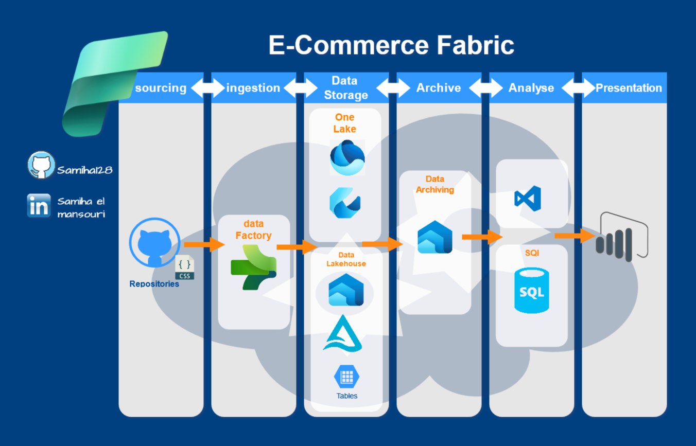

#  E_commerce-fabric


# Ecommerce Analysis Project

## Table of Contents 📋
- [Overview](#overview)
- [Installation](#installation)
- [Usage](#usage)
- [Difficulties](#difficulties)
- [Points to Improve](#points-to-improve)
- [Tools](#tools)
- [Architecture](#architecture)
- [Dashboard](#dashboard)
- [Contact](#contact)

## 🚀 Overview
This project aims to analyze ecommerce data to derive insights into customer behavior, sales trends, and inventory management. The data ingestion is performed using ** Data Factory**, and the data is stored in **OneLake**, a data lakehouse solution. Analysis is carried out using SQL, followed by data archiving and visualization in **Power BI**.

### Key Features:
1. **Data Ingestion**: Utilize Fabric Data Factory for efficient data ingestion from various ecommerce sources.
2. **Data Storage**: Store data in OneLake, leveraging its capabilities as a data lakehouse for efficient data management.
3. **Data Analysis**: Perform SQL queries to analyze the data and extract meaningful insights.
4. **Data Visualization**: Use Power BI to create dashboards and reports for better decision-making.

## 🛠️ Installation
To set up and run this project, follow these steps:

1. Clone the repository:
    ```bash
    git clone https://github.com/Samiha128/E_commerce-fabric/tree/main.git
    ```
2. Navigate to the project directory:
    ```bash
    cd ecommerce-analysis
    ```

3. Set up your Fabric Data Factory and configure the data ingestion pipeline.

4. Configure your OneLake connection for data storage.

## 🚀 Usage
This project includes SQL scripts and Power BI files for analyzing and visualizing ecommerce data.

### Steps to use the project:

1. **Ingest Data**: Run the data ingestion pipeline in FABRIC Data Factory to load ecommerce data into OneLake.
2. **Analyze Data**: Use SQL queries to analyze the ingested data in OneLake.
3. **Visualize Data**: Open the Power BI file to visualize the results of your analysis and generate reports.

## 🛠️ Difficulties
- Ensuring smooth data ingestion from various ecommerce platforms.
- Managing data quality and consistency during the ingestion process.
- Efficiently querying large datasets stored in OneLake.
- Designing insightful Power BI dashboards for data visualization.

## 🔧 Points to Improve
- Optimize data ingestion pipelines for faster processing.
- Implement data validation checks to ensure data quality.
- Enhance Power BI reports with more detailed visualizations and insights.

## 🛠 Tools
- **FABRIC Data Factory**: For data ingestion and ETL processes.
- **OneLake**: As the data lakehouse for storing ecommerce data.
- **SQL**: For data analysis and querying.
- **Power BI**: For data visualization and reporting.
- **Git**: For version control.

## 🏗 Architecture
The architecture of the project consists of:
1. **Ecommerce Data Sources**: Data is collected from various ecommerce platforms.
2. **Data Ingestion**: Managed by FABRIC Data Factory to load data into OneLake.
3. **Data Lakehouse**: OneLake serves as the storage solution for ingested data.
4. **Data Analysis**: SQL queries are executed on the data in OneLake.
5. **Data Visualization**: Power BI is used to create dashboards for reporting.



## 📊 Dashboard
The Power BI dashboards provide visual insights into:
- Customer purchasing patterns.
- Sales trends over time.
- Inventory levels and stock management.


## 📞 Contact
For any questions or issues, feel free to reach out:
[](https://www.linkedin.com/in/samiha-el-mansouri-27505b250/)
